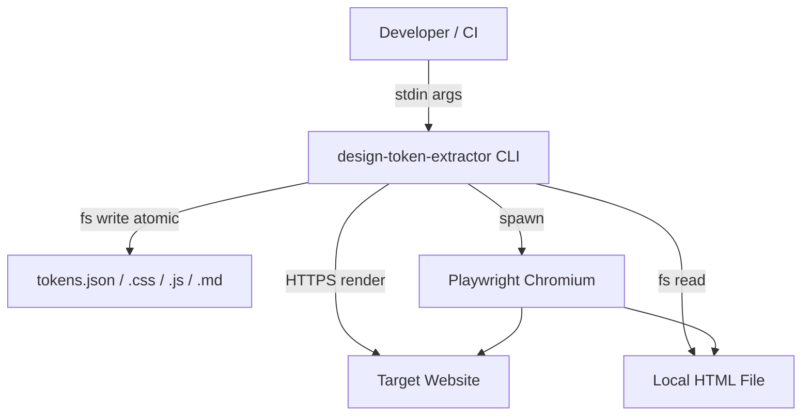
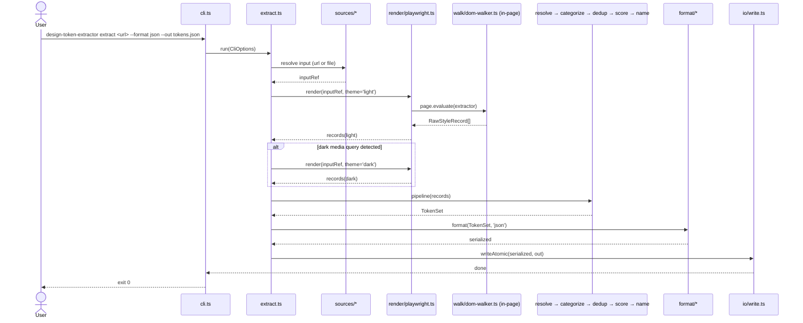

# Solution Design Document

## Validation Checklist

### CRITICAL GATES (Must Pass)

- [x] All required sections are complete
- [x] No [NEEDS CLARIFICATION] markers remain
- [x] Architecture pattern clearly stated with rationale
- [x] All architecture decisions confirmed by user
- [x] Every interface has specification

### QUALITY CHECKS (Should Pass)

- [x] All context sources listed with relevance
- [x] Project commands discovered from package.json
- [x] Constraints → Strategy → Design → Implementation path logical
- [x] Every component in diagram has directory mapping
- [x] Error handling covers all error types
- [x] Quality requirements measurable
- [x] Component names consistent
- [x] Developer could implement from this design

---

## Constraints

- **CON-1:** Node ≥18, ESM-only, TypeScript strict. Target `node18` via tsup bundle. No CommonJS output.
- **CON-2:** Single `bin` entry `design-token-extractor` → `./dist/cli.js`. Must install globally and via `npx`.
- **CON-3:** 60-second soft extraction budget. Configurable via `--timeout`. Headless browser must always clean up on exit (success or error).
- **CON-4:** Output is W3C DTCG-compatible JSON as canonical format. Alternate formats (CSS, JS, MD) are transforms on top.
- **CON-5:** No network except target URL fetches. No telemetry server. No data retention. GDPR-aligned.
- **CON-6:** Must not execute `file://` URLs for remote-URL mode (SSRF/local-file exfil). Local file input goes through `--file <path>` which validates the path explicitly.
- **CON-7:** No barrel exports (`index.ts`). Always import from specific files (per CLAUDE.md).
- **CON-8:** TDD mandatory: Red–Green–Refactor (per CLAUDE.md).

## Implementation Context

### Required Context Sources

#### Documentation Context
```yaml
- doc: docs/specs/001-design-token-extractor/product-requirements.md
  relevance: CRITICAL
  why: "PRD drives every feature, AC, and risk tracked here."

- doc: .research/spec-004-design-extractor-research.md
  relevance: HIGH
  why: "Original requirements research — 12 edge cases, 10 AC, 5 personas."

- url: https://tr.designtokens.org/format/
  relevance: HIGH
  why: "W3C DTCG draft spec — output schema compliance."

- url: https://playwright.dev/docs/api/class-page
  relevance: HIGH
  why: "Page API for render + evaluate-in-page for computed-style walking."

- url: https://www.npmjs.com/package/postcss
  relevance: MEDIUM
  why: "Parse @media rules and keyframes from stylesheets for breakpoint + motion extraction."

- url: https://www.npmjs.com/package/commander
  relevance: MEDIUM
  why: "CLI framework — already scaffolded in deps."
```

#### Code Context
```yaml
- file: packages/design-token-extractor/package.json
  relevance: CRITICAL
  why: "Deps, scripts, bin entry. Needs Playwright added."

- file: packages/design-token-extractor/src/cli.ts
  relevance: CRITICAL
  why: "Current entry — stub to replace."

- file: packages/design-token-extractor/tsup.config.ts
  relevance: MEDIUM
  why: "Bundle config — entry, target, shebang banner."

- file: packages/design-token-extractor/tsconfig.json
  relevance: MEDIUM
  why: "Strict TS settings, ES2022/ESM."

- file: packages/design-token-extractor/vitest.config.ts
  relevance: MEDIUM
  why: "Test runner config — needs update for tests dir and setup."
```

#### External APIs
```yaml
- service: Playwright (chromium)
  doc: https://playwright.dev/docs/api/class-page
  relevance: HIGH
  why: "Headless render, emulateMedia for prefers-color-scheme, page.evaluate for in-page style extraction."

- service: Target website (variable)
  doc: n/a (per-URL)
  relevance: HIGH
  why: "Input. May return 4xx/5xx, redirect, or be JS-rendered."
```

### Implementation Boundaries

- **Must Preserve:** `package.json#bin`, `tsup.config.ts` entry, ESM output, `engines.node>=18`.
- **Can Modify:** everything in `src/`, dependency list (add `playwright`, `zod` for schema validation), `vitest.config.ts` (add setup/test paths).
- **Must Not Touch:** other packages in monorepo, root-level configs, `.research/` files.

### External Interfaces

#### System Context Diagram



#### Interface Specifications

```yaml
inbound:
  - name: "CLI arguments (stdin/argv)"
    type: process.argv
    format: POSIX-style flags via commander
    authentication: none
    doc: this SDD §"CLI Surface"
    data_flow: "URL or --file path; output format and flags"

outbound:
  - name: "Target website HTTP(S)"
    type: HTTPS
    format: HTML/CSS/JS
    authentication: none (public only in v1)
    doc: n/a
    data_flow: "Fetch + render via Playwright"
    criticality: HIGH

  - name: "Filesystem output"
    type: fs
    format: JSON | CSS | JS | Markdown
    authentication: n/a
    doc: this SDD §"Output Schema"
    data_flow: "Atomic temp-file write + rename"
    criticality: HIGH

  - name: "Playwright bundled Chromium"
    type: subprocess
    format: n/a
    authentication: n/a
    doc: https://playwright.dev/
    data_flow: "Render target; evaluate scripts to extract computed styles"
    criticality: HIGH

data:
  - name: "stdout / stderr"
    type: tty
    connection: direct
    doc: this SDD §"Error Handling"
    data_flow: "Progress via ora; errors to stderr; optional JSON to stdout"
```

### Cross-Component Boundaries

N/A — single-package CLI within a monorepo. No inter-component contracts.

### Project Commands

```bash
# Discovered from packages/design-token-extractor/package.json
Install:   npm install          # within packages/design-token-extractor
Dev:       npm run dev          # tsup --watch
Test:      npm test             # vitest run
Lint:      npm run lint         # eslint src/
Build:     npm run build        # tsup
Typecheck: npm run typecheck    # tsc --noEmit

# New (post-Playwright install):
Browser:   npx playwright install chromium
```

## Solution Strategy

- **Architecture Pattern:** Pipeline (pure-function stages) behind a thin CLI shell. Each stage is independently testable with fixtures.
- **Integration Approach:** Single CLI package; no integration with other monorepo packages in v1. Playwright runs in-process; no server, no queue.
- **Justification:** Pipeline maps cleanly to TDD. Each stage (fetch → render → walk → resolve → dedup → score → format) has a narrow contract, easy to mock. Matches PRD's "framework-agnostic, computed-style" strategy — everything downstream of `render` is a pure transform on a `RawStyleRecord[]` stream.
- **Key Decisions:**
  - Playwright over Puppeteer (ADR-1).
  - W3C DTCG draft as output schema (ADR-2).
  - Value-indexed auto naming (ADR-3).
  - Research-doc confidence thresholds (ADR-4).

## Building Block View

### Components

```mermaid
graph LR
    CLI[cli.ts<br/>commander] --> Orchestrator[extract.ts<br/>orchestrator]
    Orchestrator --> Source[sources/<br/>url.ts, file.ts]
    Source --> Renderer[render/playwright.ts]
    Renderer --> Walker[walk/dom-walker.ts]
    Walker --> Resolver[resolve/css-vars.ts]
    Resolver --> Categorizers[categorize/<br/>color, typography, spacing,<br/>radius, shadow, zindex,<br/>breakpoint, motion]
    Categorizers --> Dedup[dedup.ts]
    Dedup --> Scorer[score.ts]
    Scorer --> Namer[name.ts]
    Namer --> Formatters[format/<br/>json.ts, css.ts, js.ts, md.ts]
    Formatters --> Writer[io/write.ts]
```



### Directory Map

```
packages/design-token-extractor/
├── src/
│   ├── cli.ts                          # MODIFY: commander entry, flags, calls extract()
│   ├── extract.ts                      # NEW: orchestrator — runs pipeline stages
│   ├── types.ts                        # NEW: RawStyleRecord, Token, TokenSet, CliOptions
│   ├── errors.ts                       # NEW: custom error classes + exit codes
│   ├── sources/
│   │   ├── url.ts                      # NEW: URL validation, HTTP reachability
│   │   └── file.ts                     # NEW: local HTML file load + validation
│   ├── render/
│   │   ├── playwright.ts               # NEW: render URL/file, emulate dark, return RawStyleRecord[]
│   │   └── extract-in-page.ts          # NEW: script injected into page via page.evaluate()
│   ├── walk/
│   │   └── dom-walker.ts               # NEW: walk elements, read getComputedStyle
│   ├── resolve/
│   │   └── css-vars.ts                 # NEW: resolve var() chains, track unresolvable
│   ├── categorize/
│   │   ├── color.ts                    # NEW: normalize + classify colors
│   │   ├── typography.ts               # NEW: font-family/size/weight/line-height
│   │   ├── spacing.ts                  # NEW: padding/margin/gap scale
│   │   ├── radius.ts                   # NEW: border-radius
│   │   ├── shadow.ts                   # NEW: box-shadow, text-shadow
│   │   ├── zindex.ts                   # NEW: z-index
│   │   ├── breakpoint.ts               # NEW: @media queries via postcss
│   │   └── motion.ts                   # NEW: transition/animation via postcss
│   ├── dedup.ts                        # NEW: merge identical values, sum usageCount
│   ├── score.ts                        # NEW: confidence from usageCount per ADR-4
│   ├── name.ts                         # NEW: value-indexed naming per ADR-3
│   ├── format/
│   │   ├── json.ts                     # NEW: DTCG JSON (canonical)
│   │   ├── css.ts                      # NEW: CSS custom properties
│   │   ├── js.ts                       # NEW: ES module export
│   │   └── md.ts                       # NEW: Markdown with swatches
│   └── io/
│       └── write.ts                    # NEW: atomic write (tmp + rename) or stdout
├── tests/
│   ├── fixtures/
│   │   ├── simple.html                 # NEW: minimal token set fixture
│   │   ├── dark-mode.html              # NEW: prefers-color-scheme fixture
│   │   ├── css-vars.html               # NEW: var() chain fixture
│   │   └── ...                         # per-edge-case fixtures
│   ├── unit/
│   │   ├── resolve.test.ts             # NEW
│   │   ├── dedup.test.ts               # NEW
│   │   ├── score.test.ts               # NEW
│   │   ├── name.test.ts                # NEW
│   │   └── categorize/*.test.ts        # NEW
│   ├── integration/
│   │   ├── extract-file.test.ts        # NEW: end-to-end against fixtures
│   │   └── cli.test.ts                 # NEW: spawn CLI binary, assert I/O
│   └── setup.ts                        # NEW: Playwright browser install check
├── package.json                        # MODIFY: add playwright, zod deps; test scripts
├── tsup.config.ts                      # KEEP
├── tsconfig.json                       # KEEP
└── vitest.config.ts                    # MODIFY: include tests/**, set testTimeout
```

### Interface Specifications

#### Internal API Changes

N/A — no external HTTP API. Internal module contracts documented as TypeScript types (see §"Application Data Models").

#### Data Storage Changes

N/A — stateless CLI.

#### Application Data Models

```typescript
// src/types.ts (summary — not prescriptive)

type CliOptions = {
  input:       { kind: 'url', url: string } | { kind: 'file', path: string };
  format:      'json' | 'css' | 'js' | 'md';
  out?:        string;                    // absent → stdout
  timeoutMs:   number;                    // default 60_000
  minConfidence: number;                  // default 0
  theme:       'auto' | 'light' | 'dark'; // 'auto' = both if dark-mode detected
  fast:        boolean;                   // skip headless, static HTML only
};

// Raw observation from page — one per (element × property) pair
type RawStyleRecord = {
  selector:  string;           // best-effort CSS path
  property:  string;           // e.g., 'color', 'padding-top'
  value:     string;           // computed value
  source:    'stylesheet' | 'inline';
  theme:     'light' | 'dark';
  scope:     string;           // ':root' or '.some-scope'
  originalVar?: string;        // if var() was resolved
};

// DTCG-compatible token
type Token = {
  $value:    string | number | Record<string, unknown>;
  $type:     'color' | 'dimension' | 'fontFamily' | 'fontWeight'
           | 'duration' | 'cubicBezier' | 'shadow' | 'number' | 'other';
  $description?: string;
  $extensions: {
    'com.dte.usage': { selectors: string[]; count: number };
    'com.dte.confidence': number;             // 0..1 per ADR-4
    'com.dte.source'?: 'stylesheet' | 'inline';
    'com.dte.unresolvedVar'?: string;
  };
};

type TokenSet = {
  $schema: 'https://design-tokens.github.io/community-group/format/';
  $metadata: {
    extractor: 'design-token-extractor';
    version:   string;         // package version
    extractedAt: string;       // ISO date
    source:    { kind: 'url'|'file'; value: string };
  };
  color:      Record<string, Token>;
  typography: Record<string, Record<string, Token>>;  // family/size/weight/lineHeight
  spacing:    Record<string, Token>;
  radius:     Record<string, Token>;
  shadow:     Record<string, Token>;
  zIndex:     Record<string, Token>;
  breakpoint: Record<string, Token>;
  motion:     Record<string, Record<string, Token>>;  // duration/easing/animation
};
```

#### Integration Points

```yaml
Playwright:
  - doc: https://playwright.dev/docs/api/class-page
  - integration: "Spawn chromium, page.goto(url) or page.setContent(html), page.emulateMedia({ colorScheme }), page.evaluate(extractor)"
  - critical_data: "RawStyleRecord[] returned from in-page script"
```

### Implementation Examples

#### Example: CSS Variable Resolution (recursive with cycle detection)

**Why this example:** PRD Feature 4 AC specifies circular chains must emit `"unresolved"` with `originalVar`. Non-obvious.

```typescript
// src/resolve/css-vars.ts
function resolveVar(
  value: string,
  scope: Record<string, string>,
  visited: Set<string> = new Set()
): { resolved: string; originalVar?: string } {
  const match = value.match(/^var\((--[\w-]+)(?:,\s*(.+))?\)$/);
  if (!match) return { resolved: value };

  const [, name, fallback] = match;
  if (visited.has(name)) return { resolved: 'unresolved', originalVar: name };
  visited.add(name);

  const next = scope[name] ?? fallback;
  if (next === undefined) return { resolved: 'unresolved', originalVar: name };
  return resolveVar(next, scope, visited);
}
```

#### Example: Confidence Scoring (ADR-4)

**Why this example:** Deterministic formula, used in tests.

```typescript
// src/score.ts
export function scoreConfidence(usageCount: number): number {
  if (usageCount >= 10) return 0.9;
  if (usageCount >= 5)  return 0.7;
  if (usageCount >= 2)  return 0.5;
  return 0.2;
}
```

#### Test Examples as Interface Documentation

```typescript
// tests/unit/score.test.ts
describe('scoreConfidence', () => {
  it('returns 0.2 for single usage', () => {
    expect(scoreConfidence(1)).toBe(0.2);
  });
  it('returns 0.9 for 10+ usages', () => {
    expect(scoreConfidence(10)).toBe(0.9);
    expect(scoreConfidence(99)).toBe(0.9);
  });
});
```

## Runtime View

### Primary Flow



### Error Handling

| Error type | Detection | User-facing behavior | Exit code |
|-----------|-----------|---------------------|-----------|
| Invalid CLI flag | commander parse fail | Print usage + error; stderr | 1 |
| URL scheme not http(s) | `sources/url.ts` validator | "Only http:// or https:// URLs are supported" | 1 |
| Both URL and `--file` given | `cli.ts` mutex check | "Specify either a URL or --file, not both" | 1 |
| File not found | `sources/file.ts` stat fail | "File not found: <path>" | 1 |
| DNS / connection refused | Playwright `page.goto` throws | "Could not reach <url>: <reason>" | 2 |
| HTTP 401/403 | response status on goto | "<url> requires authentication. Try --file <local.html>" | 2 |
| Extraction timeout | orchestrator `setTimeout` wrapper | "Extraction timed out after <N>s — consider --file or --fast" | 2 |
| Playwright crash | process error | "Renderer crashed: <stderr tail>" + cleanup | 3 |
| Output write fail | fs error | "Could not write output: <reason>"; no partial file | 3 |
| Internal invariant | assert/zod parse | "Internal error (please file a bug): <msg>" | 3 |

### Complex Logic

```
ALGORITHM: Theme-aware extraction
INPUT: inputRef (URL or file), CliOptions
OUTPUT: TokenSet

1. records_light := render(inputRef, emulateMedia: light)
2. has_dark_rule := parseStylesheets(records_light.styleSheets)
                      .some(rule => rule.mediaQuery matches prefers-color-scheme:dark)
3. IF has_dark_rule AND options.theme != 'light':
     records_dark := render(inputRef, emulateMedia: dark)
     records := tag(records_light, 'light') ++ tag(records_dark, 'dark')
   ELSE:
     records := tag(records_light, 'light')
4. resolved := resolveCssVars(records)
5. categorized := categorize(resolved)   // map to category buckets
6. deduped := dedup(categorized)         // sum usage, track selectors
7. scored := score(deduped)              // per ADR-4 thresholds
8. named := name(scored)                 // value-indexed per ADR-3
9. filtered := filter(named, options.minConfidence)
10. RETURN buildTokenSet(filtered, $metadata)
```

### CLI Surface

```
Usage: design-token-extractor extract [options] [url]

Arguments:
  url                       Target URL (http/https). Mutually exclusive with --file.

Options:
  --file <path>             Extract from local HTML file instead of URL.
  -f, --format <fmt>        Output format: json | css | js | md  (default: json)
  -o, --out <path>          Output file path (default: stdout)
  --timeout <seconds>       Extraction timeout (default: 60)
  --min-confidence <num>    Filter tokens below confidence (default: 0)
  --theme <auto|light|dark> Theme emulation (default: auto)
  --fast                    Skip headless browser; static HTML only
  --user-agent <string>     Override UA (default: realistic Chrome UA)
  --version                 Print version
  -h, --help                Show help

Subcommands (v1):
  extract                   Extract tokens (primary)
  # (compare in Should-Have; not a v1.0 command)
```

## Deployment View

### Single Application Deployment

- **Environment:** user's local machine or CI runner.
- **Distribution:** npm registry, single package `design-token-extractor`. `npm i -g` or `npx`.
- **Runtime dependencies:** Node ≥18; Playwright runs `npx playwright install chromium` on first run (or via postinstall hook).
- **Configuration:** flags and env. No config files in v1.
- **Performance target:** ≤30s for 90% of sites; ≤60s soft cap.

### Multi-Component Coordination

N/A — single CLI.

## Cross-Cutting Concepts

### Pattern Documentation

```yaml
- pattern: "Pipeline of pure functions" (implicit, not formal doc)
  relevance: HIGH
  why: "Each stage is independently testable; supports TDD per CLAUDE.md."

- pattern: "Atomic file write (tmp + rename)"
  relevance: HIGH
  why: "PRD Feature 8 AC: no partial output on failure."

- pattern: "Zod schema validation at boundaries"
  relevance: MEDIUM
  why: "Validate CliOptions + TokenSet before write; catches internal drift."
```

### User Interface & UX

**CLI UX:**
- `ora` spinner with stage labels: `fetching → rendering → extracting (light) → extracting (dark) → deduping → writing`.
- Colorized error messages via Commander's default formatter.
- `--quiet` flag suppresses spinner for CI.
- Help output includes worked examples.

### System-Wide Patterns

- **Security:**
  - URL scheme allowlist: only `http:` / `https:`. Reject `file:`, `data:`, `javascript:` at URL parse.
  - `--file` path resolved with `path.resolve`; warn on symlinks; no traversal protection beyond OS permissions.
  - Playwright launched with defaults (sandbox on); no `--no-sandbox` unless explicitly requested.
  - No secrets ever read from env or stored in output.
- **Error handling:** fail-fast at boundaries; single top-level try/catch in `cli.ts` that maps errors → exit codes.
- **Performance:** single-pass DOM walk; records produced in-page to minimize IPC; stylesheet parsing (postcss) lazy (only when breakpoints/motion categorizer runs).
- **Logging:** stderr for progress/errors; stdout reserved for output when `--out` absent.
- **i18n/L10n:** English only v1.

### Multi-Component Patterns

N/A.

## Architecture Decisions

- [x] **ADR-1 Headless browser:** Playwright (chromium).
  - Rationale: Built-in `emulateMedia({ colorScheme })` maps directly to theme detection; auto-wait semantics simpler than Puppeteer; better multi-browser if v2 expands beyond Chrome.
  - Trade-offs: ~200MB install vs. Puppeteer ~170MB; extra dep weight; acceptable for CLI tool install.
  - User confirmed: **Yes (2026-04-17)**.

- [x] **ADR-2 Token format:** W3C DTCG community draft.
  - Rationale: Emerging standard, `$value/$type/$extensions` shape is neutral and tool-portable; Style Dictionary can consume DTCG.
  - Trade-offs: Spec still in draft — format may evolve; we pin and document version in `$metadata`.
  - User confirmed: **Yes (2026-04-17)**.

- [x] **ADR-3 Naming strategy:** Value-indexed (`color-1`, `color-2`, …) ordered by `usageCount` descending.
  - Rationale: Deterministic, no guessing heuristics, honest about what we observed; users can rename post-hoc with any naming tool.
  - Trade-offs: Less ergonomic than semantic names; doesn't leverage selector context.
  - User confirmed: **Yes (2026-04-17)**.

- [x] **ADR-4 Confidence formula:** Stepwise thresholds from research §6.
  - Rationale: Simple, explainable, documented; tuneable later without breaking API.
  - Formula: `count>=10 → 0.9`; `count>=5 → 0.7`; `count>=2 → 0.5`; else `0.2`.
  - User confirmed: **Yes (2026-04-17)**.

- [x] **ADR-5 Validation library:** Zod at boundaries (CliOptions parse, TokenSet pre-write).
  - Rationale: Runtime type safety prevents malformed output; small dep.
  - Trade-offs: +1 runtime dep; acceptable.
  - User confirmed: **Implicit via SDD approval** (flag if disagree).

- [x] **ADR-6 Package layout:** Flat `src/**` modules, no barrel `index.ts`.
  - Rationale: CLAUDE.md forbids barrel exports.
  - User confirmed: **Derived from CLAUDE.md**.

## Quality Requirements

- **Performance:**
  - ≤30s p90 extraction on 10-site benchmark (PRD §Success Metrics).
  - ≤60s p99 or timeout with clear message.
  - ≤200MB RAM peak for 10k-node pages.
- **Usability:**
  - `--help` is self-sufficient (no external docs needed for happy path).
  - Error messages always include remediation hint.
- **Security:**
  - Only `http`/`https` URL schemes. File input gated behind `--file`.
  - No network except target URL resource fetches.
  - Playwright launched with default sandbox.
- **Reliability:**
  - Atomic output (tmp + rename). No partial files.
  - Browser process always cleaned up (try/finally around render).
  - No resource leaks across repeated runs (single-shot process).
- **Testability:**
  - Each pipeline stage has unit tests with fixtures.
  - Integration tests use `--file` fixtures (offline, deterministic).
  - Target ≥85% line coverage for non-render code; render covered by integration.

## Acceptance Criteria

**Main flow (PRD Feature 1 — URL extraction):**
- [ ] WHEN the user invokes `extract <url>` with a reachable URL, THE SYSTEM SHALL produce DTCG JSON within 60 seconds and exit 0.
- [ ] WHEN the target site requires JS to render, THE SYSTEM SHALL render via Playwright and capture computed styles from the post-render DOM.
- [ ] THE SYSTEM SHALL always terminate the Playwright browser process on exit regardless of success or error.

**Main flow (PRD Feature 2 — file input):**
- [ ] WHEN the user invokes `extract --file <path>`, THE SYSTEM SHALL load the file in a headless context and produce equivalent output to URL mode.

**Token coverage (PRD Feature 3):**
- [ ] THE SYSTEM SHALL emit keys for `color`, `typography`, `spacing`, `radius`, `shadow`, `zIndex`, `breakpoint`, `motion` in every output, using empty collections when a category has no observed tokens.

**CSS var resolution (PRD Feature 4):**
- [ ] WHEN a property value is `var(--name)` and `--name` resolves to a concrete value, THE SYSTEM SHALL emit the resolved value.
- [ ] IF a `var()` chain is circular or unresolvable, THEN THE SYSTEM SHALL emit `"unresolved"` with `$extensions."com.dte.unresolvedVar"` set to the original variable name.

**Dedup + scoring (PRD Feature 5):**
- [ ] WHEN the same value appears under multiple selectors, THE SYSTEM SHALL emit one token whose `com.dte.usage.count` equals the total observations.
- [ ] THE SYSTEM SHALL score confidence per ADR-4 thresholds.

**Theme handling (PRD Feature 6):**
- [ ] WHEN the target has `prefers-color-scheme: dark` rules, THE SYSTEM SHALL extract both themes and tag each token with its theme.
- [ ] WHERE no dark rules exist, THE SYSTEM SHALL emit only light tokens (no empty dark section).

**Output formats (PRD Feature 7):**
- [ ] WHERE `--format json` (default), THE SYSTEM SHALL emit DTCG-compliant JSON.
- [ ] WHERE `--format css|js|md`, THE SYSTEM SHALL emit the respective transform with equivalent token content.

**Error handling (PRD Feature 8):**
- [ ] IF the URL returns 401/403, THEN THE SYSTEM SHALL exit 2 with a message suggesting `--file`.
- [ ] IF any fatal error occurs after partial extraction, THEN THE SYSTEM SHALL write no output file (atomic semantics).
- [ ] IF extraction exceeds `--timeout`, THEN THE SYSTEM SHALL exit 2 with a timeout message.

## Risks and Technical Debt

### Known Technical Issues

- None at spec time — codebase is a stub. Fresh implementation.

### Technical Debt

- Current `src/cli.ts` is a placeholder and must be replaced.
- `vitest.config.ts` lacks test-path includes and timeout; requires update.
- No `.eslintrc` visible; `npm run lint` may fail until ESLint config is added.

### Implementation Gotchas

- **Playwright install size:** `npx playwright install chromium` is required; document in README and fail gracefully with install instructions if the browser is missing.
- **Dark-mode detection:** A site may have the media query declared but no actual style overrides; don't emit an empty `dark` section — drop dark if the extracted dark record set is empty post-dedup.
- **CSS variable scope:** `var()` resolution must respect scope (`:root` vs `.theme-dark`). Store resolved-per-scope values; dedup across scope only when identical.
- **Inline style weighting:** Per research EC7, stylesheet tokens should weight 2× in dedup to prevent inline styles dominating the token set. Confidence scoring does NOT double-count — dedup weighting is for tie-breaking, not counts.
- **Atomic write on Windows:** `fs.rename` across devices fails; use same-directory temp file.
- **Browser cleanup on SIGINT:** install a signal handler that closes the browser before exit.
- **Deterministic naming:** value-indexed names depend on sort order. Tie-break by hex/string value so CI output is reproducible.
- **Zod schemas at boundaries only** — do NOT zod-validate every intermediate in the hot path; only CliOptions and final TokenSet.

## Glossary

### Domain Terms

| Term | Definition | Context |
|------|------------|---------|
| Design token | Named primitive value that represents a visual design decision (color, spacing, etc.) | Core output artifact |
| DTCG | Design Tokens Community Group — W3C group defining token format spec | ADR-2 output format |
| Confidence | Heuristic 0..1 score of how likely a value is a real token vs. one-off | ADR-4 |
| Theme variant | Tokens scoped to a color scheme (light / dark) | PRD Feature 6 |
| Value-indexed naming | Deterministic `<category>-<N>` names ordered by usage count | ADR-3 |

### Technical Terms

| Term | Definition | Context |
|------|------------|---------|
| Computed style | Final style value after cascade, inheritance, and `var()` resolution, as reported by `getComputedStyle()` | Core extraction mechanism |
| Headless browser | Chromium without GUI, spawned by Playwright | Render stage |
| Atomic write | Write-then-rename pattern ensuring no partial file on crash | Output reliability |
| SSRF | Server-side request forgery | Security mitigation (URL scheme allowlist) |
| EARS | Easy Approach to Requirements Syntax — WHEN/IF/WHILE/WHERE patterns | Acceptance criteria format |

### API/Interface Terms

| Term | Definition | Context |
|------|------------|---------|
| `RawStyleRecord` | Intermediate record for one `(element, property, value)` observation | Pipeline internal |
| `TokenSet` | Full output data structure — metadata + category buckets | Canonical JSON schema |
| `$value / $type / $extensions` | DTCG token envelope fields | Output JSON shape |
